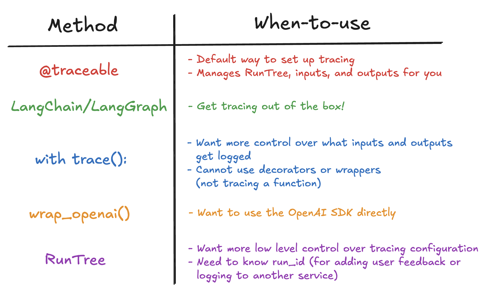
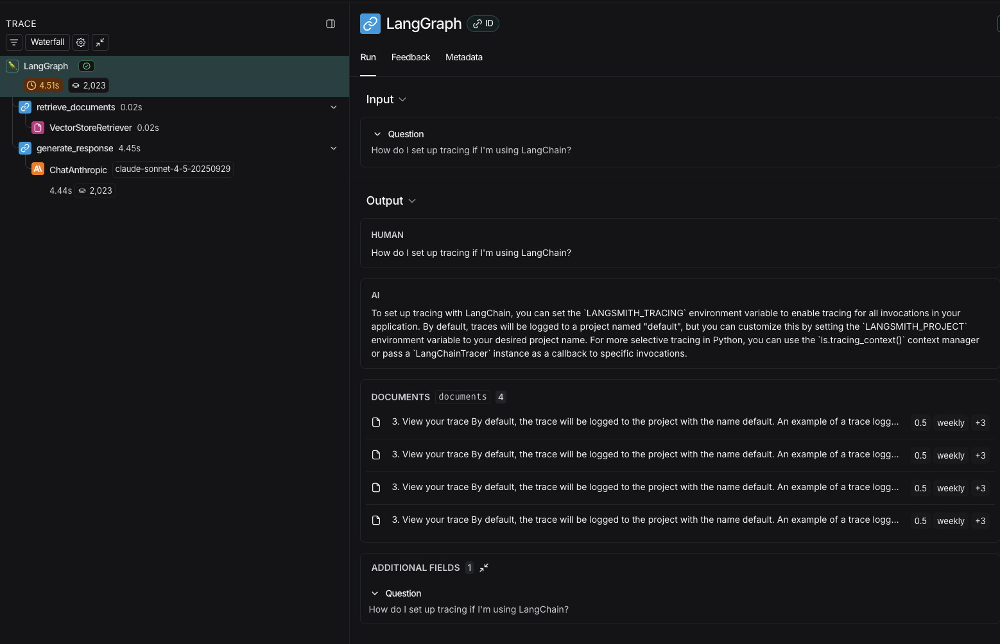
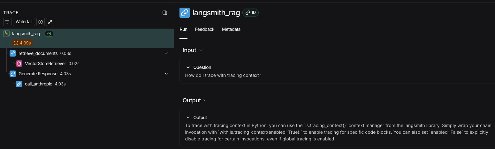
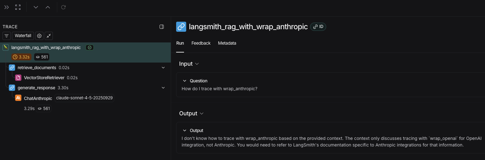
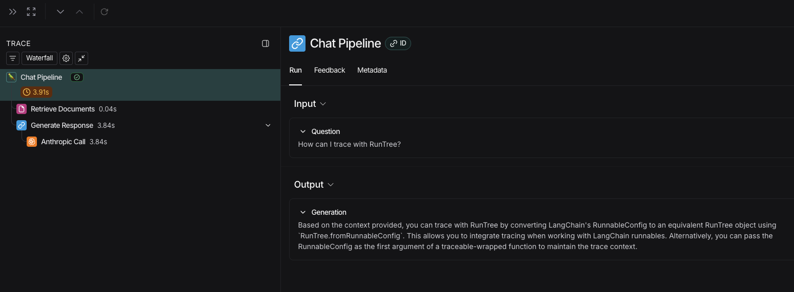

## Alternative methods for Tracing

Python notebooks that I have used/modified for this lesson: [alternative_tracing_methods.ipynb](resources/alternative_tracing_methods.ipynb)

This video explores different methods and tools for tracing, including built-in tracing in frameworks like LangChain, as well as external tools like OpenTelemetry and Phoenix. It discusses the pros and cons of each approach and how to integrate them into your workflow.

Apart from langchains built-in tracing, I have also learnt how to use OpenTelemetry and Phoenix for tracing.
Phoenix offers a visual interface for exploring traces and understanding complex chains.
OpenTelemetry is an open-source project that provides a framework for tracing.

This image from the course video mentions 'wrap_openai()' that I have changed to 'wrap_anthropic()'.
This along with many other changes were made to the code to make it compatible with anthropic instead because I don't want to use OpenAI.

### Notable things
#### 1. Context Manager (with trace())

Useful when we need custom control over what gets logged
Lets us manually set inputs/outputs
Good for non-standard code structures

#### 2. Wrapper (wrap_anthropic)

Automatic tracing without decorators
Just have to wrap your client: wrap_anthropic(Anthropic())
Still compatible and can work along @traceable on other functions

#### 3. RunTree API

Maximum control at the cost of maximum complexity
We manually create parent/child runs
Good for building custom frameworks or very specific needs