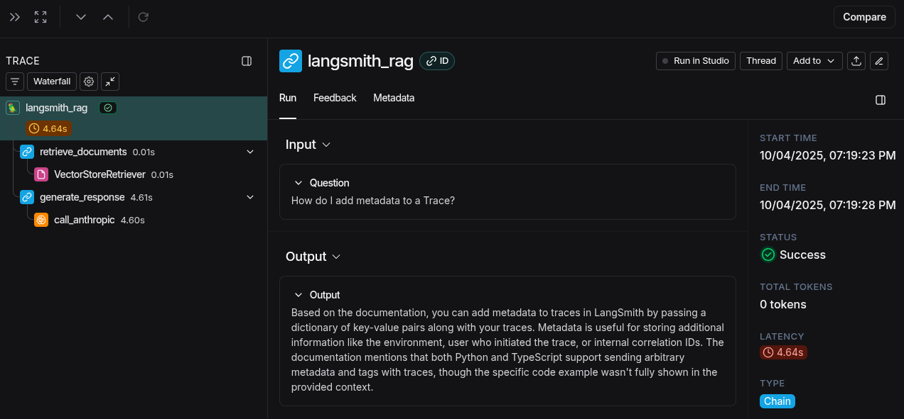
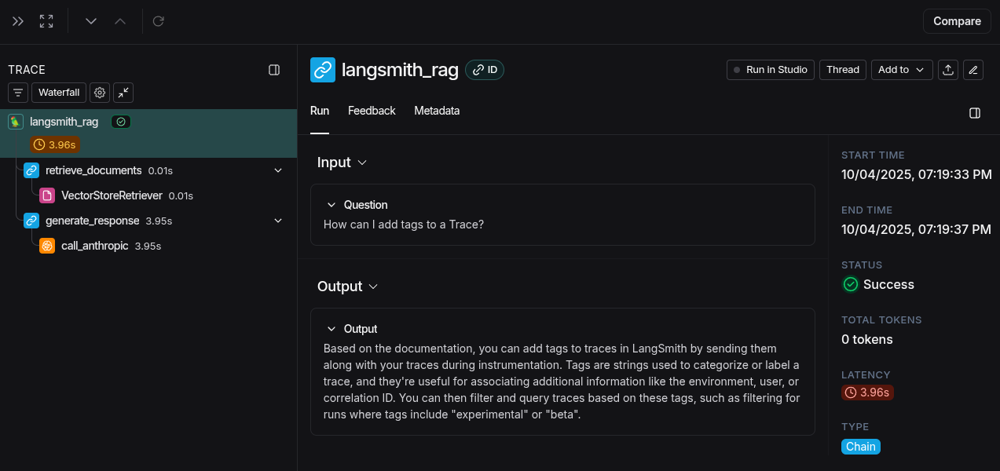
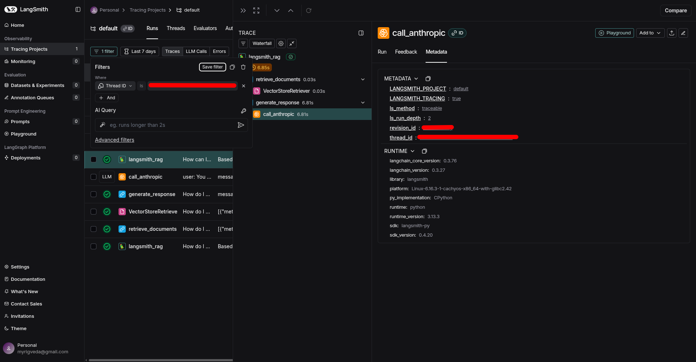

## Conversational Threads

Python notebooks that I have used/modified for this lesson: [conversational_threads.md](resources/conversational_threads.ipynb)

This section focuses on tracing in the context of conversational applications, where maintaining context across multiple turns is crucial. It explains how to group runs into threads and visualize the flow of a conversation.

Conversational threads let you see how context is maintained across multiple user inputs and model responses.

Grouping runs by thread helps you debug issues that only appear in multi-turn conversations.

You can trace the entire conversation, not just individual messages, to understand user experience.

### Screenshots from LangSmith

I have removed my thread id, but yes you can see that it was in a thread, and that metadata is attached.