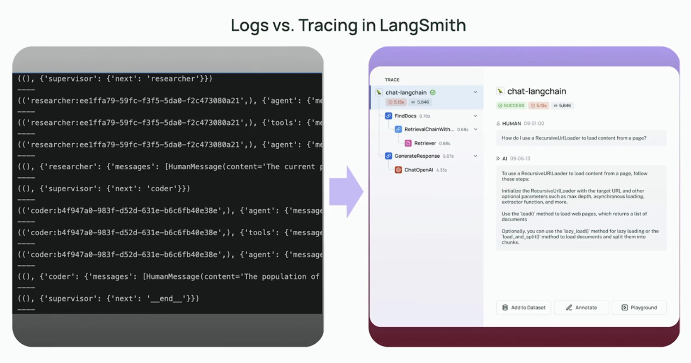
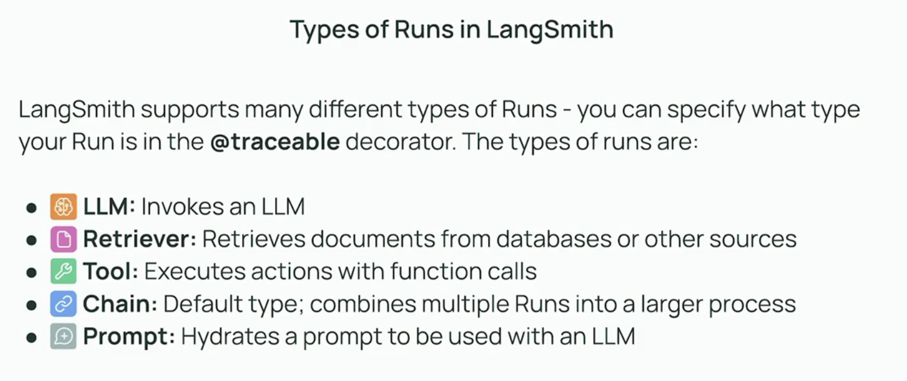

## Types of Runs

Python notebooks that I have used/modified for this lesson: [types_of_runs.ipynb](resources/types_of_runs.ipynb)

This video goes over the different types of runs you might come across in an LLM application, such as chain runs, tool runs, and LLM runs.
It explains how each type is represented in a trace and why distinguishing them is useful for debugging and optimization.

Chain runs represent the overall workflow, while tool runs and LLM runs are the individual steps or calls within that workflow.
Understanding the hierarchy of runs helps us pinpoint where errors or bottlenecks occur.
We can filter traces by run type to focus on specific parts of the application.