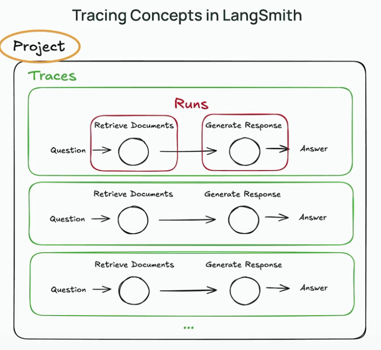
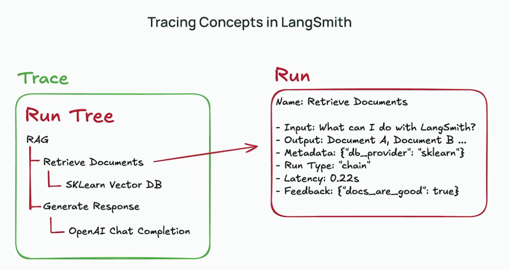

## Tracing Concepts In LangSmith

Projects: Projects act as containers that group multiple traces together.

Our Project is a RAG application.

Runs: A run represents a single unit of work or operation in your LLM application, such as a call to a model, retriever, tool, or sub-chain.

Traces: A trace is a collection of related runs that together represent the full end-to-end execution of a single operation or user request. 

In short, a trace is an end-to-end execution of a program
Each unit of work or logic is a run.

In a RAG application, retrieve documents and generate a response are the two major runs.

@traceable is a decorator that enables automatic tracing of functions by logging inputs, outputs, errors, and metadata to create detailed run traces for observability and debugging in LLM applications.

With tracing we can debug issues like unexpected outputs or failures by replaying with the exact sequence of operations.