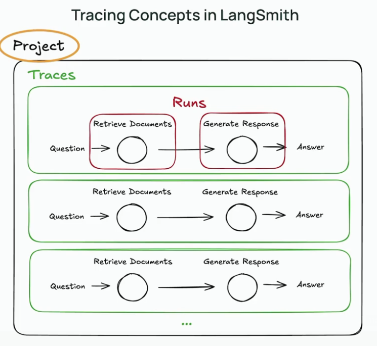

## Tracing Concepts In LangSmith

Python notebooks that I have used/modified for this lesson: [tracing_basics.ipynb](resources/tracing_basics.ipynb)

Projects: Projects act as containers that group multiple traces together.

Our Project is a RAG application.

Runs: A run represents a single unit of work or operation in your LLM application, such as a call to a model, retriever, tool, or sub-chain.

Traces: A trace is a collection of related runs that together represent the full end-to-end execution of a single operation or user request. 

In short, a trace is an end-to-end execution of a program
Each unit of work or logic is a run.

In a RAG application, retrieve documents and generate a response are the two major runs.

@traceable is a decorator that enables automatic tracing of functions by logging inputs, outputs, errors, and metadata to create detailed run traces for observability and debugging in LLM applications.

With tracing we can debug issues like unexpected outputs or failures by replaying with the exact sequence of operations.

List of changes made:
 1. Replaced the OpenAI calls with Claude
 2. Changed the utils file to use HuggingFace Embeddings instead of OpenAI
 3. Changed the last cell of [tracing_basics.ipynb](resources/tracing_basics.ipynb) to better test and check the RAG application.

### Screenshots of langsmith web interface:
This is how we can see what we have traced

