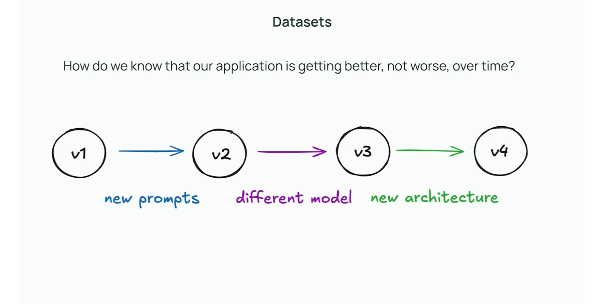
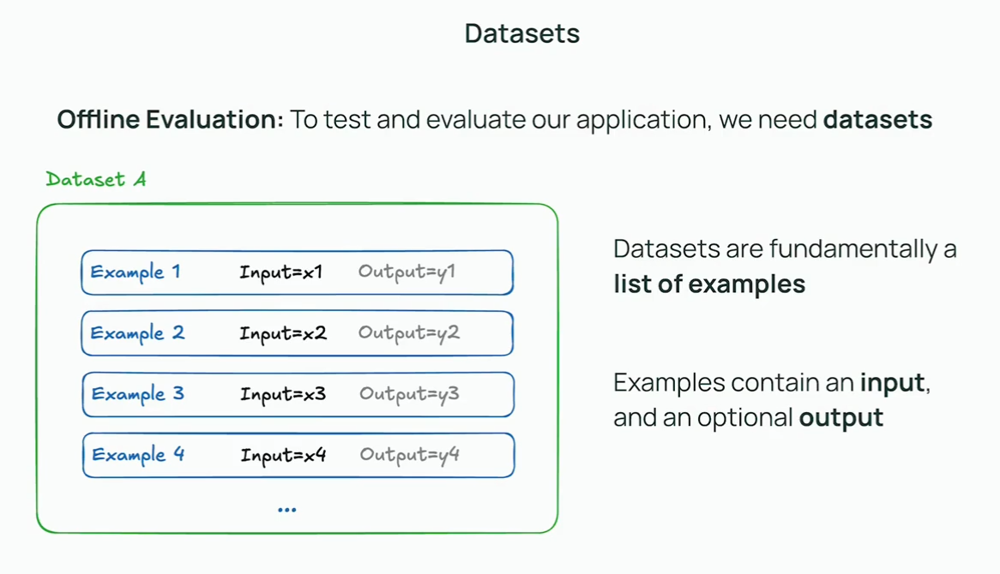
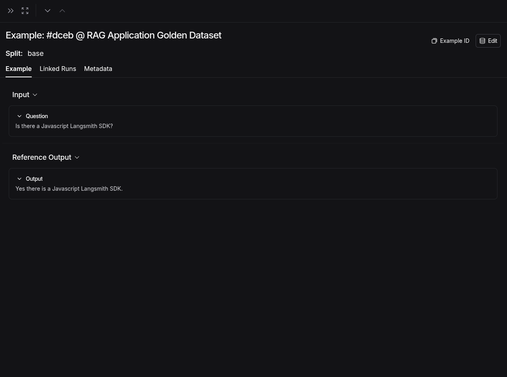
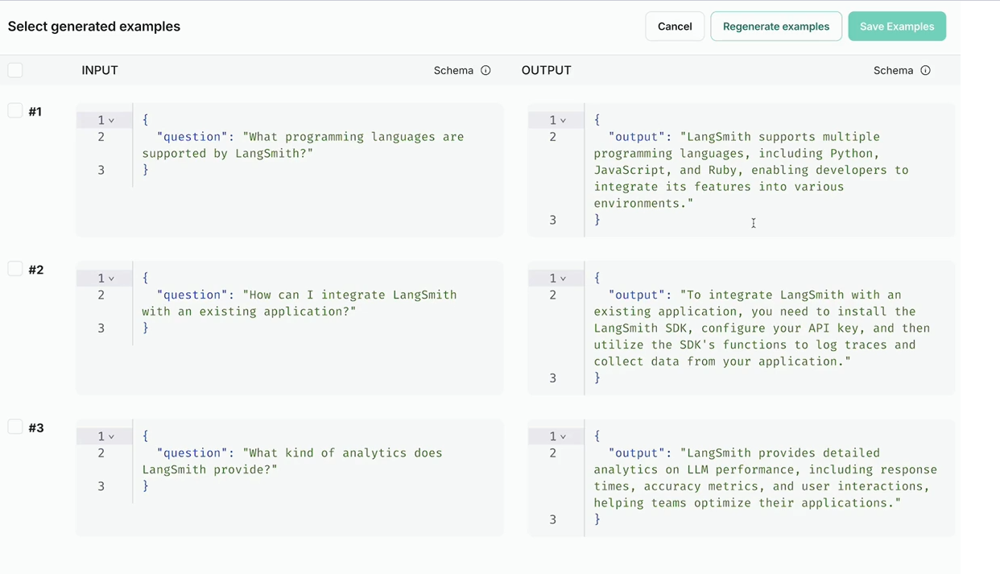

## Datasets

This video introduces the concept of datasets for LLM evaluation. It explains how to create, manage, and use datasets to systematically test and benchmark your LLM applications.

Datasets are collections of input-output pairs that you can use to evaluate your LLM's performance.

Organizing your test cases into datasets makes it easier to run experiments and track progress over time.

You can import datasets from CSV files or create them programmatically.

Created a custom example in a custom dataset:

You can also generate examples provided that you have an OpenAI api key (I do not):
