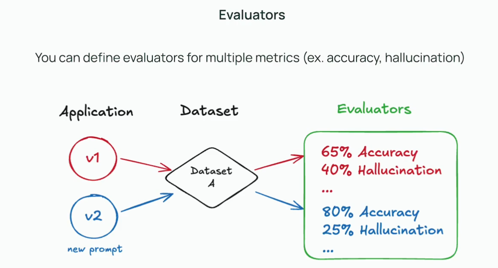
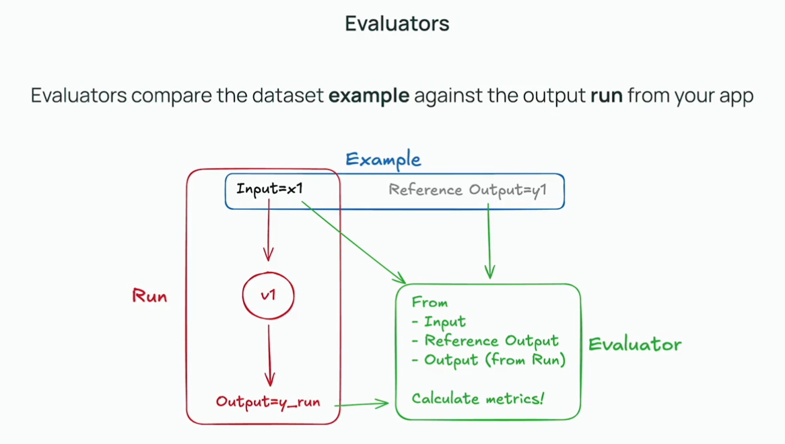

## Evaluators

Python notebook: [evaluators.ipynb](resources/evaluators.ipynb)

This section covers evaluators—tools or functions that automatically assess the quality of LLM outputs. It explains different types of evaluators, such as exact match, semantic similarity, and custom evaluators.

Evaluators let you automate the process of checking whether your LLM's outputs are correct or useful.

You can use built-in evaluators or write your own to handle specific requirements.

Combining multiple evaluators gives you a more comprehensive view of model performance.

Created custom evaluator (new ui):
