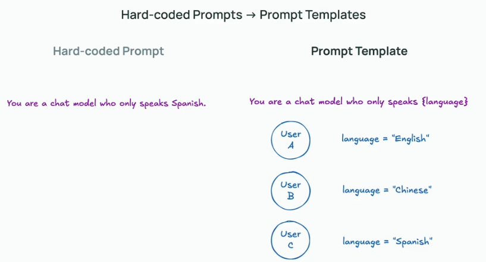
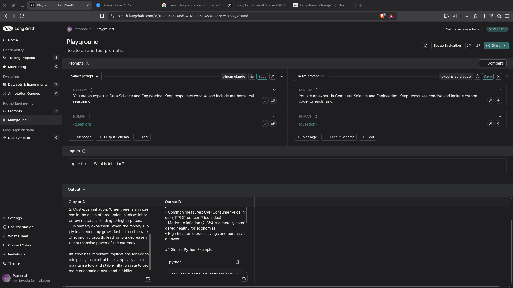
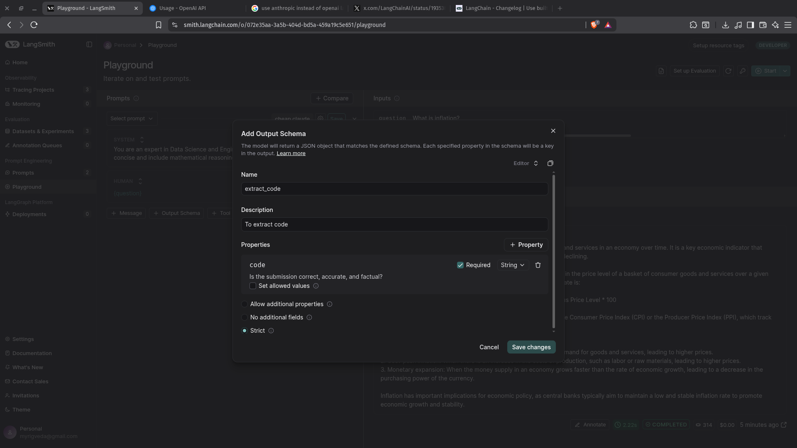
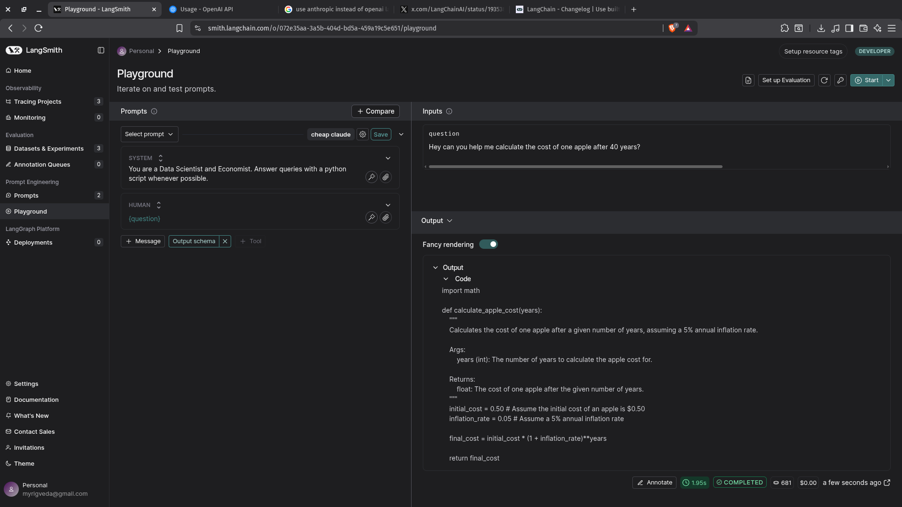
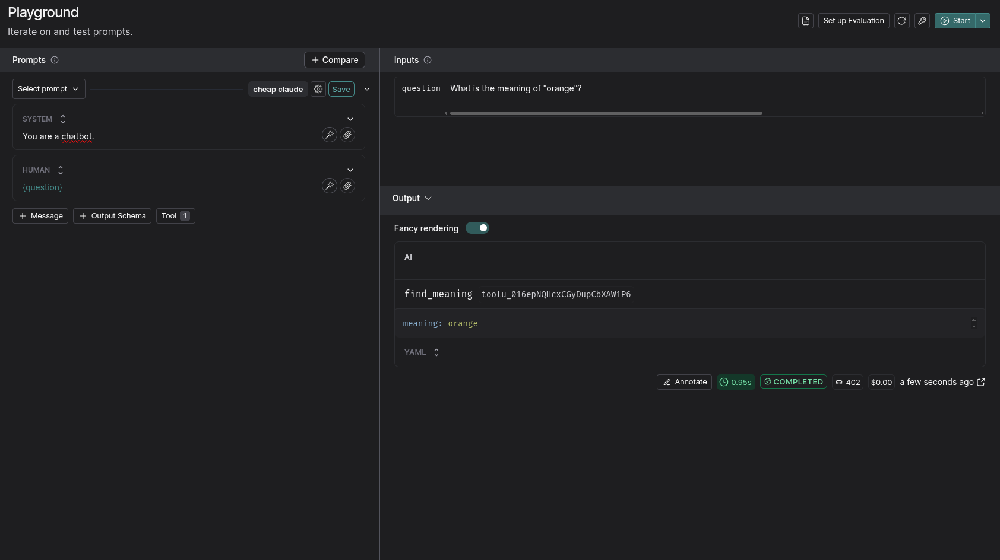
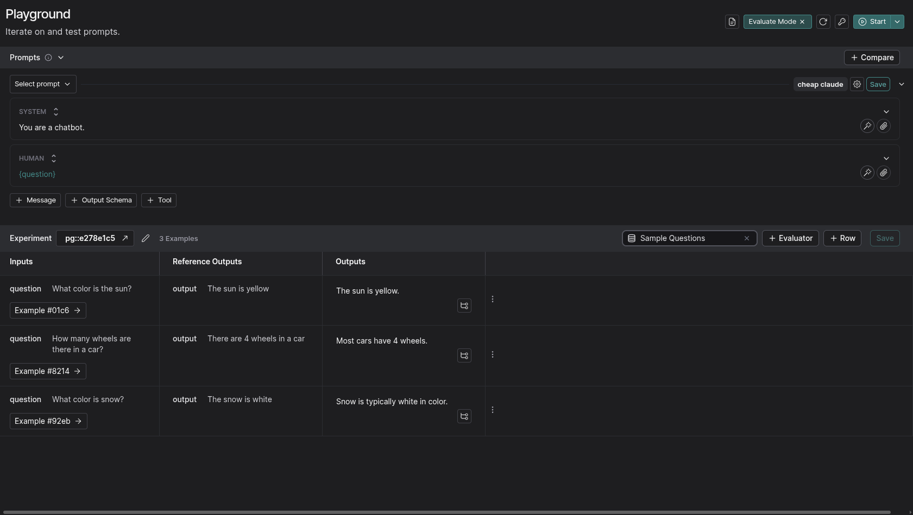

## Playground

Files [playgrounds_experiments.ipynb](resources/playground_experiments.ipynb)

In this video, we learn how to use the LangSmith Playground to experiment with prompts and prompt templates for language models. The Playground lets us quickly test different prompt configurations, adjust variables, and compare model outputs. We see how changing the system prompt can dramatically affect the results, and we practice running prompts with different models and settings.

When we think about prompts, we usually think about them as hard-coded strings that tell the LLM exactly what to do.

Changing the system prompt dramatically changes our output.

Repetitions are really useful to improve consistency and just double check that you're able to respond to a question correctly every time.

Using the web interface, we can compare model performance and output while simultaneously monitoring the cost.

Some models also support output schemas.

We can also enable tools.

We can run this over a dataset with reference outputs.

