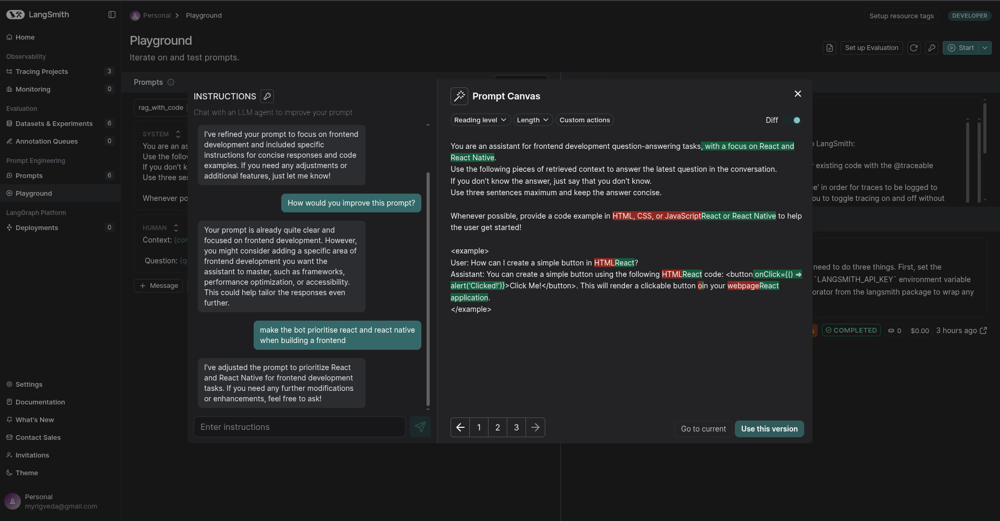
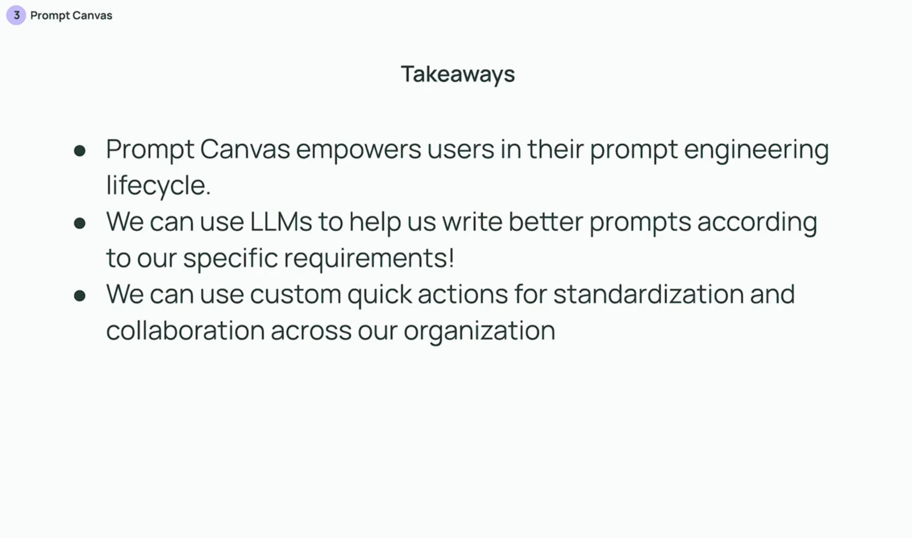

## Prompt canvas

No files for this video, it was demonstrated only using the web interface.

The Prompt Canvas gives us a way to collaborate and standardize our prompts using an LLM agent. We can ask the agent to generate, rewrite, edit, or improve our prompts, and we can track changes with versioning and diff views. Quick actions help us maintain consistency and quality across a team.

Canvas uses an LLM agent to help you improve your prompts, which is pretty meta.

You can also manually edit any version of a prompt directly in the canvas.

