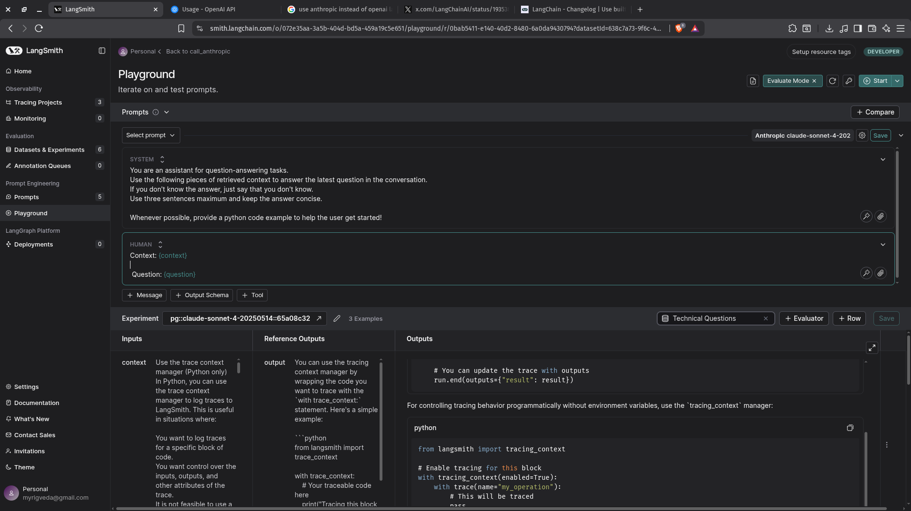

## Prompt Engineering Cycle

 File [prompt_engineering_lifecycle.ipynb](resources/prompt_engineering_lifecycle.ipynb)

We learn a practical example of how to use the Playground and Prompt Hub together in a RAG application. By refining our prompts and testing them with datasets, we can ensure our code always uses the latest version of the prompt. This workflow makes it easier for us to improve our applications without constantly updating the code.

If the user asked how they can set up tracing with traceable, it'd be really helpful to provide a code example to that user as well.

I no longer have to change my code every single time I update the prompt.

We provide a code example. We also provide a code example for our context manager, and we do so as well for the traceable decorator.

This is our custom made prompt:

Which we can then call in our code

