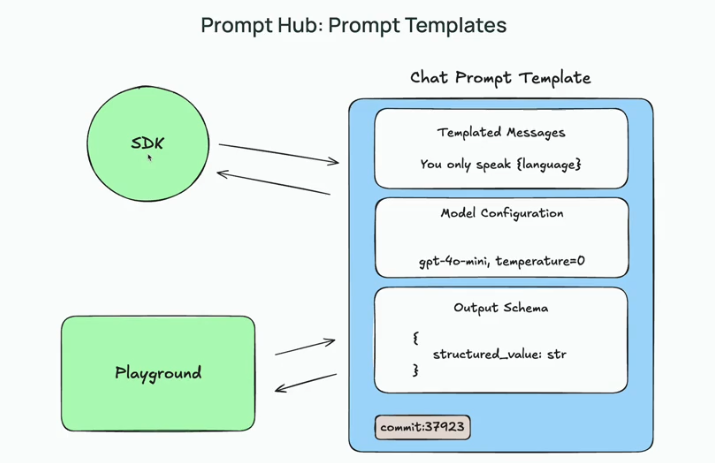

## Prompt Hub

File [prompt_hub.ipynb](resources/prompt_hub.ipynb)

This video introduces us to the Prompt Hub, where we can store, version, and share our prompt templates. We learn how to save prompts, fork them for new versions, and pull them into our code using the SDK. The Prompt Hub helps us keep track of changes and collaborate more easily as we iterate on our prompts.

Most LLM developers will share the experience of hardcoding their prompts directly into their code.

This will create a new commit on our existing prompt.

One of the coolest parts of PromptHub is that we can actually take this prompt and use it locally within our code.

We can push prompts from our code.

